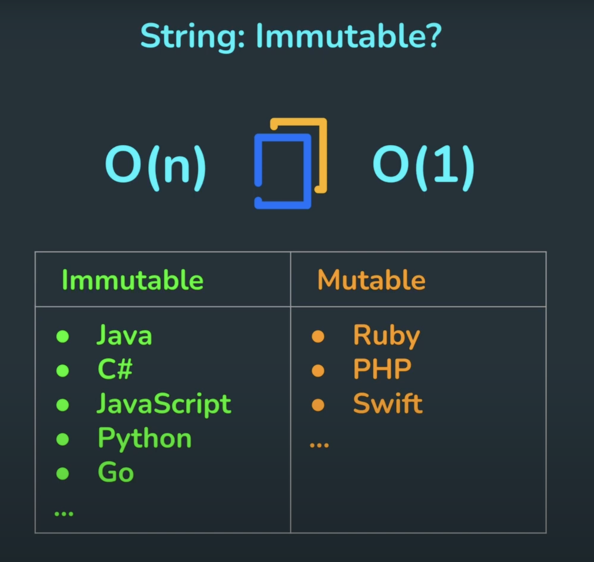

# Primitives vs Objects

There are 7 primitive data types: string, number, bigint, boolean, undefined, symbol, null

Primitives:

- Immutable
- Basic units
- Passed and copied by value // See. pass-by-value

Objects:

- Mutable
- Complicated structures
- Passed and copied by reference // See. pass-by-reference

Example 1

```js
let a = 21;
let b = a;

console.log({ a, b });
console.log("a===b", a === b);

a = 25;

console.log({ a, b });
console.log("a===b", a === b);
```

Example 2

```js
let a = [3, 5, 7, 9];
let b = a;

console.log({ a, b });
console.log("a===b", a === b);

a[2] = 25;

console.log({ a, b });
console.log("a===b", a === b);

a = [1, 2, 3];

console.log({ a, b });
console.log("a===b", a === b);
```

Example 3

```js
let a = 21;

const myFunc = (x) => {
  x += 4;
  console.log("In the function", x);
};

myFunc(a);

console.log("Outside the function", a);
```

Example 4

```js
let a = [1, 2, 3];

const myFunc = (x) => {
  x[1] = 4;
  console.log("In the function", x);
};

myFunc(a);

console.log("Outside the function", a);
```

Example 5

```js
let a = [1, 2, 3];

const myFunc = (x) => {
  x = [1, 2, 3];
  console.log("In the function", x);
};

myFunc(a);

console.log("Outside the function", a);
```

# immutable or not?

JavaScript strings are immutable. Cannot be modified.
Normally, primitive values don't have properties or methods. JS treats the strings as objects. (ツ)
String methods do not change the original variables. They all return a new value.



- Working with arrays instead of strings, char[]
- See StringBuilder classes

## What is the time complexity?

```js
let str = "";

for (let i = 0; i < 10; i++) {
  str += String.fromCharCode(97 + i);
}

console.log(str);
```

It's O(n^2) :(

```js
let arr = [];

for (let i = 0; i < 10; i++) {
  arr.push(String.fromCharCode(97 + i));
}

console.log(arr.join(""));
```

It's O(n)
