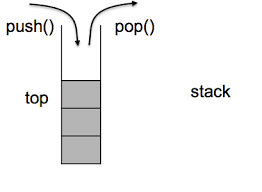

# Stack: Last-in-First-out (LIFO)

Stack is a data structure works with Last-In-First-Out (LIFO) principle.
The most-recently-added element will be removed first.




## Typical Operations / Methods

1. **push(x)**: Adding onto the top
2. **pop()**: Removing from the top
3. peek()?: Read the element at the top
4. isEmpty()?: Checking if the stack is empty
5. size()?: Returning the number of items inside
6. ...

is the size fixed?
what to return when empty?

## Built-in classes vs Using Arrays as stacks

[Java Stack](https://www.javatpoint.com/java-stack)
[Stack in C++](https://www.geeksforgeeks.org/stack-in-cpp-stl/)

If no built-in class, we can implement a Stack class or use an array as a stack

```js
var stack = [];
```

## A common usage

See. Depth-First Search (DFS)
