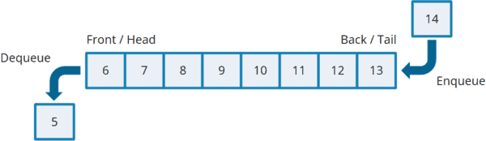

# Queue: First-in-First-out (FIFO)

Queue is a data structure works with First-in-First-out (FIFO) principle.
The first added element will be removed first.

## Typical Operations / Methods

1. **enqueue(x)**: Adding to the rear
2. **dequeue()**: Removing from the front. a.k.a. poll(), remove()
3. peek()?: Read/retrieve the head element
4. isEmpty()?: Checking if the stack is empty
5. size()?: Returning the number of items inside
6. ...

## Built-in classes

[Java Queue](https://docs.oracle.com/javase/8/docs/api/java/util/Queue.html)
[C++ Queue](https://www.programiz.com/cpp-programming/queue)

## Arrays as Queues ?

Q: Is it a good idea to use arrays as queues? Why would it be inefficient?

[Circular Queue on LeetCode](https://leetcode.com/explore/learn/card/queue-stack/228/first-in-first-out-data-structure/1396/)
[Introduction to Circular Queue on GeeksforGeeks](https://www.geeksforgeeks.org/introduction-to-circular-queue/)

[LeetCode 622. Design Circular Queue](https://leetcode.com/problems/design-circular-queue/description/)

## A common usage

See. Breadth-first Search (BFS)

## Deque (double-ended queue)

Deque is a data structure which supports the addition or removal from either end.
It can be used as Stack or Queue

## Playing around

[LeetCode 232. Implement Queue using Stacks](https://leetcode.com/problems/implement-queue-using-stacks/)
[LeetCode 225. Implement Stack using Queues](https://leetcode.com/problems/implement-stack-using-queues/)
